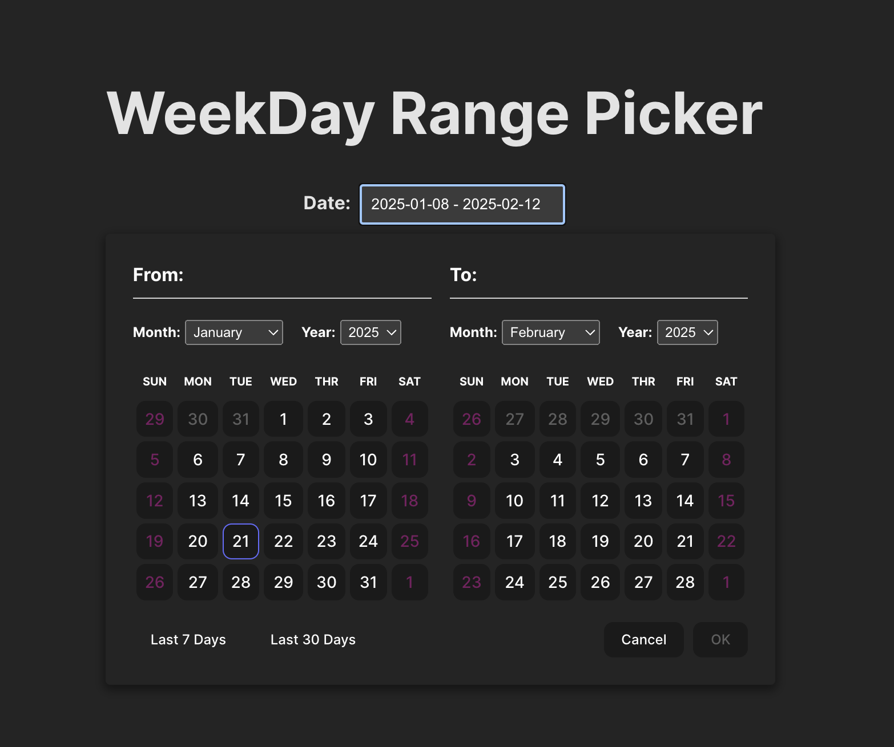
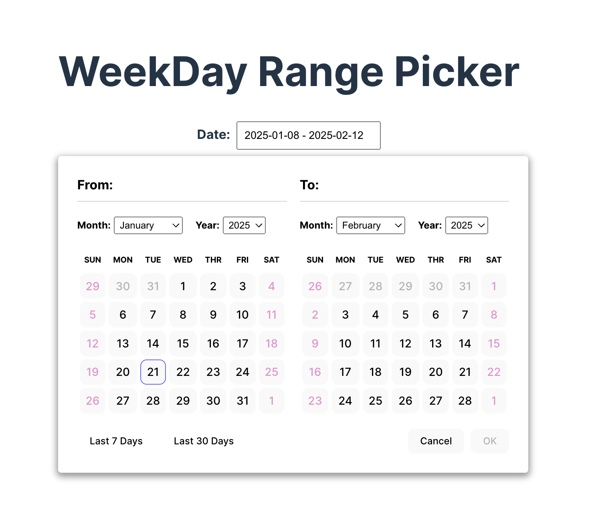

# Weekday Date Picker

This is a simple React based date range picker that allows users to select only weekdays (Monday through Friday) and prevents weekend selection. The component is fully accessible and includes features like month/year navigation and predefined ranges (e.g., last 7 days, last 30 days).

## Features

- **Select Weekdays Only**: Prevents weekend selection.
- **Date Range Highlighting**: Highlights the selected date range, excluding weekends.
- **Predefined Ranges**: Quickly select predefined ranges like the last 7 or 30 days.
- **Accessibility**: Fully accessible, following ARIA guidelines for grids and date pickers.
- **Customizable**: Easy to integrate and adapt to various projects.

## Getting Started

Clone the repository and install dependencies:

```bash
git clone https://github.com/dev-sammy/weekday-date-picker.git
cd weekday-date-picker
npm install
npm run dev
```

## Demo




You can also try the live demo [here](https://weekday-date-picker-tau.vercel.app/)

## Contributions

Contributions are welcome! If you find a bug or have a feature request, please create an issue or submit a pull request. Ensure your code follows the project's coding standards and includes relevant tests.

## License

This project is licensed under the MIT License. Feel free to use it in your projects.
